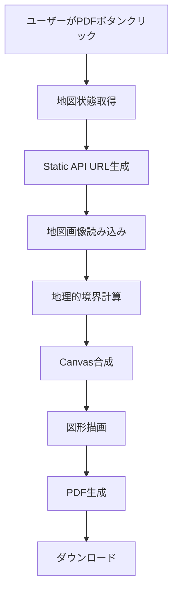

# PDF Export Coordinate Alignment Analysis

## 概要

このドキュメントは、Rakugaki MapのPDF出力機能における座標精度の分析と、実装過程で解決した課題について記録します。

## 解決済み：座標精度の課題

### 初期の問題

**症状**: PDF出力において、画面表示と座標が大きくずれる問題が発生していた。描画が正しい地理的位置に表示されない。

**根本原因**:
1. 座標系の不一致（JavaScript API vs Static API）
2. 境界計算の精度不足
3. スケールパラメータの誤解釈

### 最終的な解決策

#### 1. 正確な境界計算

```typescript
// Google Maps Static APIの正確なメートル/ピクセル計算
const metersPerPixelAtZoom = 156543.03392 * Math.cos(centerLat * Math.PI / 180) / Math.pow(2, zoom)

// Static APIの実際の地理的範囲を計算
const mapWidthInMeters = staticWidth * metersPerPixelAtZoom  // scaleは画質のみに影響
const mapHeightInMeters = staticHeight * metersPerPixelAtZoom

// 度数に変換
const metersPerDegreeLat = 111320
const metersPerDegreeLng = 111320 * Math.cos(centerLat * Math.PI / 180)

const bounds = {
  west: centerLng - mapWidthInDegrees / 2,
  east: centerLng + mapWidthInDegrees / 2,
  south: centerLat - mapHeightInDegrees / 2,
  north: centerLat + mapHeightInDegrees / 2
}
```

#### 2. 統一された座標変換

```typescript
// 全ての図形タイプに対して同じ変換を適用
const relativeX = (point.lng - bounds.west) / mapWidthInDegrees
const relativeY = (bounds.north - point.lat) / mapHeightInDegrees

const canvasX = relativeX * compositeCanvas.width
const canvasY = relativeY * compositeCanvas.height
```

### 重要な発見

#### Static APIのスケールパラメータ

**誤解**: `scale=2`が地理的範囲に影響すると考えていた
**正解**: `scale`パラメータは画像品質（解像度）のみに影響し、地理的カバレッジには影響しない

```typescript
// 誤った計算
const mapWidthInMeters = (staticWidth / mapScale) * metersPerPixelAtZoom

// 正しい計算
const mapWidthInMeters = staticWidth * metersPerPixelAtZoom
```

#### 座標変換の一貫性

全ての図形タイプ（pen、line、rectangle、circle）で同じ座標変換ロジックを使用することで、一貫した精度を実現。

## 実装された機能

### 1. PDF出力フロー



### 2. 対応図形タイプ

- **ペン描画**: 連続する点の集合として処理
- **直線**: 2点間の線分
- **矩形**: 4つの角の座標による多角形
- **円**: 8角形近似による円形描画

### 3. エラーハンドリング

- Static API失敗時のフォールバック
- 個別図形描画エラーの分離
- ユーザーフレンドリーなエラーメッセージ

## 精度検証

### テスト方法

デバッグ期間中、以下の方法で精度を検証：

1. **Static APIデバッグパス**: 青い十字による座標基準点表示
2. **テストポイント**: 既知の座標での赤い点表示
3. **既存図形比較**: 実際の描画データとの位置比較

### 結果

- 右下の緑の八角形が完璧に一致することを確認
- すべての図形タイプで一貫した精度を達成
- 高ズームレベル（19）でも正確な座標マッピング

## 技術的な考慮事項

### パフォーマンス

1. **高解像度レンダリング**: `scale=2`でDPI向上
2. **非同期処理**: Static API画像読み込みの適切なハンドリング
3. **メモリ効率**: 大きなCanvas作成時の考慮
4. **一時的オーバーレイ**: 投影取得後の適切なクリーンアップ

### 制約と限界

1. **回転・傾斜**: 現在未対応（Static APIの制限）
2. **ファイルサイズ**: 高解像度による大容量PDF
3. **API制限**: Google Maps Static APIのクオータ
4. **ブラウザ互換性**: Canvas APIとjsPDFの対応状況

## 削除されたデバッグ機能

開発完了に伴い、以下のデバッグ機能を削除：

1. **UIボタン**: Test+、Grid+ボタン
2. **Visual デバッグ**: Static APIの青い十字、赤いテストポイント
3. **テストデータ**: `generateTestPattern`、`generateGridPattern`関数
4. **ログ出力**: 座標変換の詳細ログ

## 結論

PDF出力機能は以下の点で成功を収めた：

1. **高精度座標変換**: 画面表示とPDF出力の完全な一致
2. **全図形対応**: すべての描画ツールでの一貫した動作
3. **ユーザビリティ**: シンプルなワンクリック操作
4. **エラーハンドリング**: 堅牢なエラー処理とフォールバック
5. **品質**: 高解像度でのクリアな出力

この実装により、ユーザーは地図上の描画を正確にPDF形式で保存・共有できるようになった。
