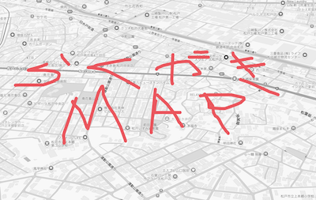

# 落書きマップ (Rakugaki Map)

地図上に描画して友人と共有できるWebアプリケーションです。



*松戸市周辺での描画例 - 赤いペンで地図上に自由に描画*

## 🚀 ライブデモ

- **🌐 本番環境**: [the-rakugaki-map.web.app](https://the-rakugaki-map.web.app/)
- **🔧 開発環境**: [rakugakimap-dev.web.app](https://rakugakimap-dev.web.app/)

## 機能

### 🎨 描画機能
- 🗺️ Google Maps上での高精度描画
- ✏️ 複数の描画ツール（ペン、直線、四角形、円、消しゴム）
- 🖊️ iPad Pencilによる筆圧感知描画
- 🎨 カラーパレット（8色）
- 📏 線の太さ調整（1-10px）
- 🖱️ マルチタッチ・Pointer API対応

### 🗺️ マップ操作
- 🧭 マップ回転（45度単位）とリセット
- 📐 マップチルト調整（0-67.5度）
- 📍 現在地取得と地図移動
- 🎨 グレースケールカスタムスタイル

### 💾 データ管理
- ⚡ スマート自動保存（描画停止から1秒後）
- 🚫 連続描画中の無駄な保存をスキップ
- 🔗 URL共有による描画の公開
- 🔒 匿名認証による安全な保存

### 🖥️ ユーザーインターフェース
- 📱 レスポンシブデザイン
- 🎛️ ドラッグ可能なフローティングコントロール
- 📍 メニュー位置切り替え（右・上）
- 🗂️ メニュー最小化機能

## 使い方

1. **アプリケーションにアクセス**
   - 上記のライブデモリンクからアクセス

2. **描画開始**
   - 「描画を開始」ボタンをクリック
   - 描画ツール（ペン、直線、四角形、円）を選択
   - 色と線の太さを設定

3. **地図上に描画**
   - iPad Pencilなら筆圧感知で線の太さが変化
   - 複数のタッチポイントに対応
   - 消しゴムツールで部分的な削除も可能

4. **自動保存**
   - 描画を停止すると1秒後に自動保存
   - 連続描画中は保存をスキップし、パフォーマンスを向上

5. **共有**
   - URLを共有して他の人に公開
   - 誰でも閲覧可能、編集は認証済みユーザーのみ

## 技術仕様

### アーキテクチャ
- **フロントエンド**: React + TypeScript + Vite
- **地図**: Google Maps JavaScript API（Vector rendering）
- **描画**: HTML Canvas + Google Maps OverlayView
- **状態管理**: カスタムReact Hooks（モジュラー設計）
- **バックエンド**: Firebase Firestore + Anonymous Authentication
- **インフラ**: Firebase Hosting + Terraform

### 主要コンポーネント
```
App.tsx (296行、リファクタリングで50%削減)
├── useAuthManager (Firebase認証)
├── useMap (地図制御・状態管理)
├── useDrawing (描画状態・自動保存)
├── useMenu (UI制御)
└── DrawingCanvas (useDrawingCanvas使用)
```

### テスト
- **テストフレームワーク**: Vitest + React Testing Library
- **カバレッジ**: 61+テスト（カスタムフック全体をカバー）
- **実行**: `npm test` または `npm run test:coverage`

## 開発者向け情報

詳細な開発情報は **[CLAUDE.md](./CLAUDE.md)** を参照してください：
- 開発環境セットアップ
- アーキテクチャの詳細説明
- CI/CDパイプライン
- インフラ管理（Terraform）
- テスト戦略
- デプロイメント手順

## 🤝 コントリビューション

プルリクエストやイシューを歓迎します！

### 開発者向け
1. このリポジトリをフォーク
2. 機能ブランチを作成 (`git checkout -b feature/amazing-feature`)
3. 変更をコミット (`git commit -m 'Add amazing feature'`)
4. ブランチにプッシュ (`git push origin feature/amazing-feature`)
5. プルリクエストを作成

### バグ報告・機能要望
[Issues](https://github.com/m0a-mystudy/rakugaki-map/issues) からお気軽にご報告ください。

## 料金について

### Google Maps API
- 月28,500リクエストまで無料
- 超過分は1,000リクエストあたり$2

### Firebase
- **Firestore**: 1日あたり50,000読み取り、20,000書き込み、1GBまで無料
- **Hosting**: 月10GBまで無料
- **Authentication**: 月50,000認証まで無料

## ライセンス

MIT License
